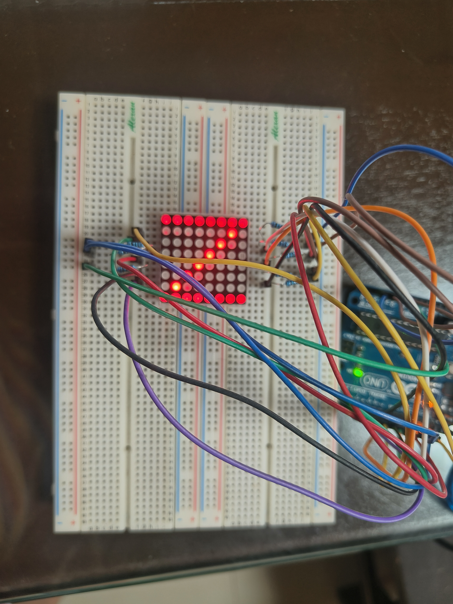
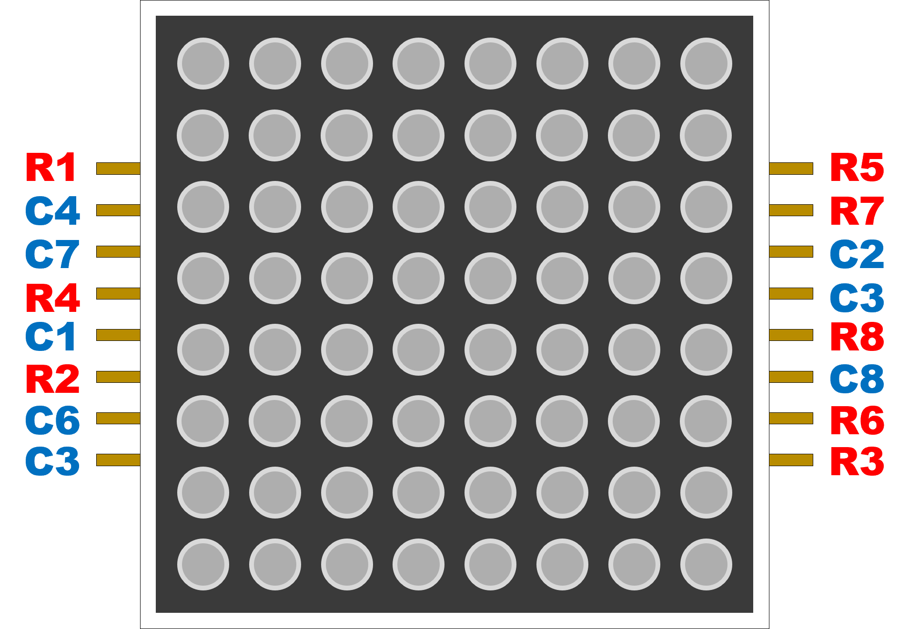
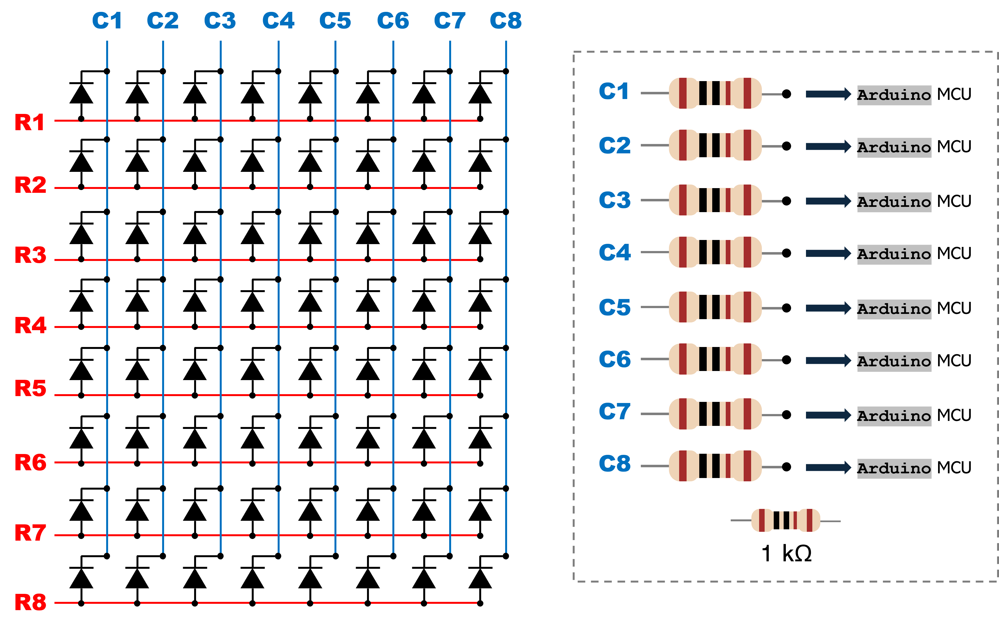

# LED Matrix Working Principle Explored in Arduino
<p align = "center"></p>

## Introduction
Last time, I created a [Christmas project](https://github.com/machinedeck/Christmas-2025-Project) with blinking lights and a Christmas greeting flashed on an LED matrix screen. The code used for the latter was completed thanks to [ChatGPT](https://chatgpt.com), but an honest understanding builds an important skill to deal with more complicated actuators. I still need to learn about the working principle of controlling each LED of the matrix independently to produce an image. However, its circuitry limits individual LED control at the same time, and it is possible that turning on one LED also turns on the undesired ones, and vice versa. This yields an incorrectly and differently displayed image.

This problem can be resolved by resorting to the idea of how videos appear continuous and smooth. In fact, they are composed of discrete frames stacked together within a specified period of time. Imagine taking continuous shots within one minute, then organizing them in a slideshow on a computer. If there are relatively few shots per minute, the slideshow may portray objects shifted or displaced in space, if they were actually moving when the images were taken. If the shots per minute are increased, these movement shifts appear subtler and slightly shorter. Increase them at the right amount and the slideshow will display the scene of what the objects were doing.

Analogously, we will do the same principle but in a slightly different manner to the LED matrix. Based on its circuitry, we can divide it into columns (or rows), focusing only on a single column at a time. We turn the LEDs not part of this column off, and we are left with an individually controllable set of light. 

In order to maintain the rest of the matrix off, the undesired column pins are set to 1 since LEDs operate only in the forward-bias. The column of focus is set to zero, and once a certain LED has to be on, the corresponding row pin is set to zero to drive a forward-bias condition. Otherwise, a row pin is just 0.

After some time, we move to the next column and switch its pin to 0 while the rest to 1. Then we do the same process as the previous column. This process is performed until all the columns are covered, and repeated again from the start. If the interval between these column lightings is slow, we can evidently observe the switching of one column to another, but smaller interval makes the switching fast enough that the eyes perceive it as stagnant. This stagnant feature makes the illusion of an image, whose developed principle we will now use to program the LED matrix.

## Materials
Refer to the datasheet [here](https://www.alldatasheet.com/datasheet-pdf/view/1147771/TOPLITE/A-1088BS.html).
<!-- <p align = "center"></p> -->
<p align = "center"></p>


## Code Breakdown

When I developed the code, I chose to put it in a non-blocking code using `millis()` just in case there would be simultaneous operations (i.e. operations that do not need to wait for others to finish). I put everything inside that `while` non-blocking code below:
```c
while (millis() - initial_time >= interval) {
   initial_time = millis();
   ...
}
```
where the ellipsis are the details which I will explain below. What the code above basically does is implicitly focus on a single column within the duration `interval`. When this duration is surpassed, the algorithm moves to the next column and initializes the pin values to display the desired image.

As we mentioned, we focus on a column at a time. For a chosen column $j$, we first set the rest of the column pins to 1 (`HIGH`):
```c
for (int jprime = 0; jprime < 8; jprime++) {
   if (jprime != j) {
     digitalWrite(cols[jprime], HIGH);
   }
   else {
     digitalWrite(cols[jprime], LOW);
   }
}
```
Then we set the row pins of column $j$. We read whether the matrix element at column $j$ from the reference image must be ON or OFF, and pass it on to the LED matrix itself:
```c
for (int i = 0; i < 8; i++) {
   int value = mat[i][j];
   digitalWrite(rows[i], mat[i][j]);
}
```
Once done, we increment $j$, but it has to go back to the first column when all the columns are covered. Hence, we have the overall conditions as follows:
```c
j++;
if (j == 8) {
   j = 0;
}
```

### Overall Code
```c
int mat[8][8] = {{1, 0, 0, 0, 0, 0, 0, 1},
                 {1, 1, 0, 0, 0, 0, 0, 1},
                 {1, 0, 1, 0, 0, 0, 0, 1},
                 {1, 0, 0, 1, 0, 0, 0, 1},
                 {1, 0, 0, 0, 1, 0, 0, 1},
                 {1, 0, 0, 0, 0, 1, 0, 1},
                 {1, 0, 0, 0, 0, 0, 1, 1},
                 {1, 0, 0, 0, 0, 0, 0, 1}};

int rows[8] = {2, 3, 4, 5, 6, 7, 8, 9};
int cols[8] = {10, 11, 12, 13, A0, A1, A2, A3};
int col_ref;
int val;
unsigned long initial_time = millis();
const int interval = 2;
int j = 0;

void setup() {
   // put your setup code here, to run once:
   
   for (int i = 0; i < 8; i++) {
      pinMode(rows[i], OUTPUT);
      pinMode(cols[i], OUTPUT);
   }
}

void loop() {
   while (millis() - initial_time >= interval) {
      initial_time = millis();
      
      // Focus on a specific column. If not chosen, then put to high
      for (int jprime = 0; jprime < 8; jprime++) {
         if (jprime != j) {
            digitalWrite(cols[jprime], HIGH);
         }
         else {
            digitalWrite(cols[jprime], LOW);
         }
      }
      
      // Check the rows. If 1, then turn on
      for (int i = 0; i < 8; i++) {
         int value = mat[i][j];
         digitalWrite(rows[i], mat[i][j]);
      }
      
      // Increment j to go to another column
      j++;
      if (j == 8) {
         j = 0;
      }
   }
}
```
